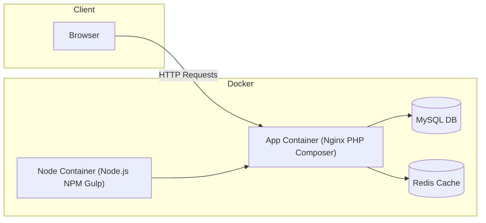

# 🚀 PHP Dockerized Development Environment

[](https://www.docker.com/)
[](https://www.php.net/)
[](https://laravel.com/)
[](LICENSE)

A **fully containerized PHP/Laravel + Node.js development environment** with Redis, MySQL, and Nginx — built for developers who want **speed, reproducibility, and zero setup headaches**.

This repository goes beyond the basics by providing:
- Separate **dev** and **CI** Docker Compose configurations
- An **intelligent helper script** to simplify all container commands
- Optimized builds with conditional **xDebug** loading
- Laravel, Composer, Node, NPM, and Gulp support — ready out of the box

---

## 📌 Features

1. **Plug-and-play** Docker setup for Laravel + Node.js development
2. `develop` helper script for simplified workflow:
   - Artisan (`art`)
   - Composer (`composer`)
   - PHPUnit tests (`test` / `t`)
   - NPM (`npm`)
   - Gulp (`gulp`)
   - Direct `docker-compose` access
3. **CI/CD friendly** — optimized for pipelines like Jenkins
4. **Dynamic environment behavior** (e.g., xDebug loads only in dev)
5. Pre-built containers:
   - `app` → Nginx + PHP-FPM + Composer
   - `node` → Node.js + NPM + Gulp

---

## ⚡ Quick Start

```bash
# Clone the repository
git clone https://github.com/yourusername/php-dockerized-dev-environment.git
cd php-dockerized-dev-environment

# Build application & Node images
./develop build

# Install Laravel dependencies
./develop composer install
./develop npm install

# Start Laravel (default: port 80)
./develop up -d

# Or start on a custom port
APP_PORT=8888 ./develop up -d
```

---

## 🔑 Environment Setup

You may need a `.env` file based on `.env.example`:

```env
APP_KEY=GENERATE-USING-ARTISAN

DB_HOST=mysql

CACHE_DRIVER=redis
SESSION_DRIVER=redis

REDIS_HOST=redis
```

**Generate Laravel app key**:
```bash
./develop art key:generate
```

---

## 🛠 Available Commands via `develop`

### 📜 Artisan
```bash
./develop art make:controller MyController
```

### 🎼 Composer
```bash
./develop composer require predis/predis
```

### 🧪 PHPUnit Tests
```bash
# Fresh container
./develop test

# Inside running container (faster)
./develop t
```

### 📦 NPM
```bash
./develop npm install
./develop npm run dev
```

### ⚙️ Gulp
```bash
./develop gulp
./develop gulp --production
```

### 🐳 Docker Compose
```bash
./develop up -d
./develop down
./develop exec app bash
```

---

## 📂 Project Structure

```
.
├── develop                # Helper script for Docker commands
├── docker-compose.yml     # Main Docker Compose config
├── docker-compose.ci.yml  # CI-specific config
├── app/                   # Laravel application code
├── node/                  # Node.js container setup
└── README.md              # You are here
```

---

## 📊 Architecture Overview



---

## 🤝 Contributing

Pull requests are welcome! Please ensure all new code is tested and documented.

---

## 📄 License

This project is licensed under the MIT License.

---

💡 **Pro Tip:**
Use this setup as a **template** for any PHP/Laravel + Node.js stack you build in the future. It’s designed to scale from local development to CI pipelines without extra config hassle.
